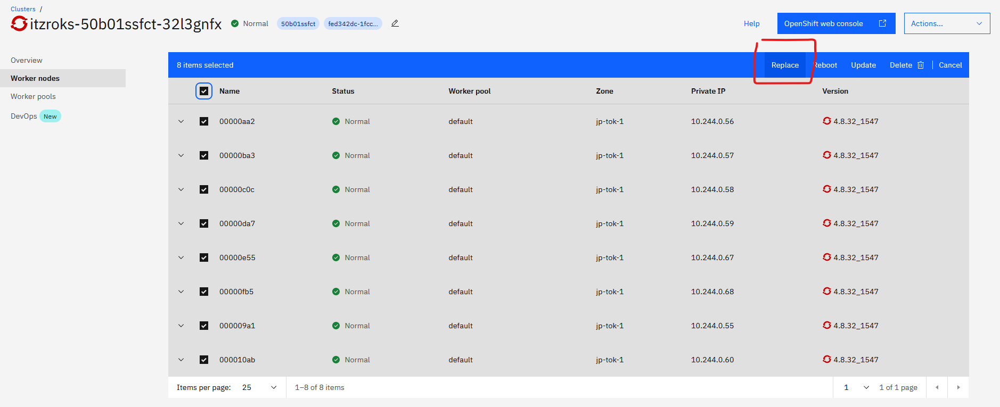

# Deploy Watson Knowledge Studio and Watson Discovery on CPD on OCP with ODF

⚠️⚠️⚠️⚠️ **WARNING** ⚠️⚠️⚠️⚠️

This is not completely automated. ArgoCD Health checks for operator's subscriptions, Cloud Pak UI's `ibmcpd` CR are not entirely working correctly. Between each stage's deployments, navigate to OpenShift Console to check if no operators and pods are pending. I need to write a job to check for resources readiness.

⚠️⚠️⚠️⚠️ **END WARNING** ⚠️⚠️⚠️⚠️

Tested on IBM Cloud ROKS on VPC Gen 2 with ODF add-on.

## Pre-requisites ⬅️

### Red Hat OpenShift cluster ⭕

Minimum OpenShift v4.8+ is required with OpenShift Data Foundation installed.

Grab a ROKS instance from Techzone with https://techzone.ibm.com/collection/custom-roks-vmware-requests. For cluster config, choose:

- 16vCPU/64GB RAM per node
- 2TB ODF
- 8 nodes


### CLI tools 💻

- Install the OpenShift CLI oc (version 4.8+) .  The binary can be downloaded from the Help menu from the OpenShift Console.

    <details>
    <summary>Download oc cli</summary>

    
    </details>
    
- Log in from a terminal window.

    ```bash
    oc login --token=<token> --server=<server>
    ```

### IBM Entitlement Key 🔑

- An `IBM Entitlement Key` is required to pull IBM Cloud Pak specific container images from the IBM Entitled Registry.

To get an entitlement key:

1. Log in to [MyIBM Container Software Library](https://myibm.ibm.com/products-services/containerlibrary) with an IBMid and password associated with the entitled software.  
2. Select the **View library** option to verify your entitlement(s).
3. Select the **Get entitlement key** to retrieve the key.
4. `export PULL_SECRET=<entitlement key>`
5. `./scripts/setup-global-cluster-pull-secret`

If you are using IBM Cloud ROKS with VPC Gen 2, navigate to your ROKS cluster Overview in IBM Cloud as shown in the figure below. Click on Worker Nodes, select all nodes and click on `Replace`. IBM Cloud ROKS VPC Gen2's nodes cannot be reloaded.



Refer to instructions at https://www.ibm.com/docs/en/cloud-paks/cp-data/4.0?topic=tasks-configuring-your-cluster-pull-images for reference.

## Setup ArgoCD


- [Red Hat OpenShift GitOps](https://docs.openshift.com/container-platform/4.8/cicd/gitops/understanding-openshift-gitops.html) uses [Argo CD](https://argoproj.github.io/argo-cd/), an open-source declarative tool, to maintain and reconcile cluster resources.

1. Install the OpenShift GitOps Operator and create a `ClusterRole` and `ClusterRoleBinding`.  

    ```bash
    oc apply -f setup/ocp/
    while ! oc wait crd applications.argoproj.io --timeout=-1s --for=condition=Established  2>/dev/null; do sleep 30; done
    while ! oc wait pod --timeout=-1s --for=condition=Ready -l '!job-name' -n openshift-gitops > /dev/null; do sleep 30; done
    ```

2. Create a custom ArgoCD instance with custom checks

    ```bash
    oc apply -f setup/ocp/argocd-instance/ -n openshift-gitops
    while ! oc wait pod --timeout=-1s --for=condition=ContainersReady -l app.kubernetes.io/name=openshift-gitops-cntk-server -n openshift-gitops > /dev/null; do sleep 30; done
    ```

    *Note:* We use a custom openshift-gitops-repo-server image to enable the use of Plugins within OpenShift Gitops. This is required to allow RHACM to utilise the Policy Generator plugin. The Dockerfile can be found here: [https://github.com/one-touch-provisioning/otp-custom-argocd-repo-server](https://github.com/one-touch-provisioning/otp-custom-argocd-repo-server).

4. If using IBM Cloud ROKS as a Hub Cluster, configure TLS.

    ```bash
    scripts/patch-argocd-tls.sh
    ```
    1. Retrieve the ArgoCD/GitOps URL and admin password and log into the UI

    ```bash
    oc get route -n openshift-gitops openshift-gitops-cntk-server -o template --template='https://{{.spec.host}}'
    
    # Passsword is not needed if Log In via OpenShift is used (default)
    oc extract secrets/openshift-gitops-cntk-cluster --keys=admin.password -n openshift-gitops --to=-
    ```

### Configure manifests for Infrastructure

If you are running a managed OpenShift cluster on IBM Cloud, you can deploy OpenShift Data Foundation as an [add-on](https://cloud.ibm.com/docs/openshift?topic=openshift-ocs-storage-prep#odf-deploy-options). Otherwise, on AWS, Azure, GCP and vSphere run the following script to configure the machinesets, infra nodes and storage definitions for the `Cloud` you are using for the Hub Cluster

   ```bash
   ./scripts/infra-mod.sh
   ```

## Install CPD, WD and WKS 🥾

⚠️⚠️⚠️⚠️ **WARNING** ⚠️⚠️⚠️⚠️

This is not completely automated. ArgoCD Health checks for operator's subscriptions, Cloud Pak UI's `ibmcpd` CR are not entirely working correctly. Between each stage's deployments, navigate to OpenShift Console to check if no operators and pods are pending. I need to write a job to check for resources readiness.

⚠️⚠️⚠️⚠️ **END WARNING** ⚠️⚠️⚠️⚠️

Deploy each stage at a time. Once the pre-install has been deployed, update the `0-bootstrap/kustomization.yaml` manifest to enable foundational-services, then install.

Example: Install pre-install

   ```yaml
   resources:
   - 1-preinstall/1-preinstall.yaml
   # Uncomment 2 when 1 is completely done.
   # - 2-foundational-services/2-foundational-services.yaml
   # Uncomment 3 when 2 is completely done.
   # - 3-install/3-install.yaml
   ```

To start the deployment,

    ```bash
    oc apply -f 0-bootstrap/bootstrap.yaml
    ```

Once installation is completed, you can follow the [Post Installation tasks](https://www.ibm.com/docs/en/cloud-paks/cp-data/4.0?topic=installing-post-installation-tasks).

Zen URL:

```
oc get ZenService lite-cr -o jsonpath="{.status.url}{'\n'}" -n cpd-instance
```

Initial admin password:

```
oc extract secret/admin-user-details --keys=initial_admin_password --to=- -n cpd-instance
```
